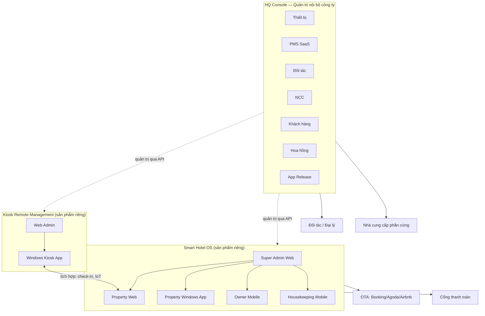

# Kiến trúc tổng quan — Smart Hotel Group

Tài liệu này là điểm vào (entry point) để hiểu toàn bộ hệ thống trước khi đọc chi tiết từng sản phẩm. Ba hệ thống độc lập, ba repo, giao tiếp qua API:

| Repo | Vai trò | Đối tượng dùng |
|---|---|---|
| `hq-console/` | **Đặc tả** (PRD, kiến trúc, module spec, permission matrix) cho trang quản trị nội bộ toàn công ty | Tài liệu tham chiếu |
| `webadmin/` | **Code chạy được** của HQ Console (Express API + Next.js web + SQL/Postgres, `docker compose up` là chạy) | Đội vận hành, kinh doanh, kế toán của công ty |
| `kiosk-management/` (spec: `kiosk.md`) | Sản phẩm bán cho khách sạn: quản lý kiosk check-in tự động | Khách hàng dùng Kiosk |
| `smart-hotel-os/` | Sản phẩm bán cho khách sạn: PMS + Channel Manager + AI Pricing + IoT + CRM | Khách hàng dùng Smart Hotel OS |

`hq-console/` chứa YÊU CẦU, `webadmin/` chứa CODE — tách hai thư mục để tài liệu đặc tả không lẫn với mã nguồn/dependency, xem `hq-console/DECISIONS.md` (ADR-005, ADR-006).

## 1. Sơ đồ tổng quan

## 2. Nguyên tắc ranh giới (đã thống nhất — xem `ADR` từng repo)

1. **Không dùng chung database hay session** giữa ba hệ thống. Mọi trao đổi dữ liệu đi qua API có version, có xác thực.
2. **HQ Console không thay thế nghiệp vụ của từng sản phẩm.** Nó gọi API quản trị (admin API) của Kiosk và Smart Hotel OS để tổng hợp và điều phối (tenant, billing, feature flag, device fleet), không cấy logic nghiệp vụ PMS/Kiosk vào chính nó.
3. **Kiosk và Smart Hotel OS tích hợp ngang hàng** qua API mở khi một khách hàng dùng cả hai (Kiosk gọi PMS để check-in/checkout, gọi IoT để kích hoạt phòng) — xem `smart-hotel-os/docs/API_SPECIFICATION.md` mục tích hợp Kiosk.
4. **Đối tác, nhà cung cấp, hoa hồng là nghiệp vụ của công ty (HQ Console)**, không phải nghiệp vụ của sản phẩm bán cho khách sạn — vì một đối tác/NCC có thể liên quan tới cả hai sản phẩm hoặc phần cứng nói chung (không riêng phần mềm nào).

## 3. Đọc tiếp theo

- Chi tiết Kiosk Remote Management: `kiosk.md`.
- Chi tiết Smart Hotel OS: `smart-hotel-os/README.md`.
- Chi tiết HQ Console (đặc tả): `hq-console/README.md`. Code chạy được: `webadmin/README.md`.
- Chuẩn bảo mật API cho đối tác bên ngoài (áp dụng chung cho cả ba hệ thống khi expose API ra ngoài): `hq-console/docs/PARTNER_API_STANDARDS.md`.
