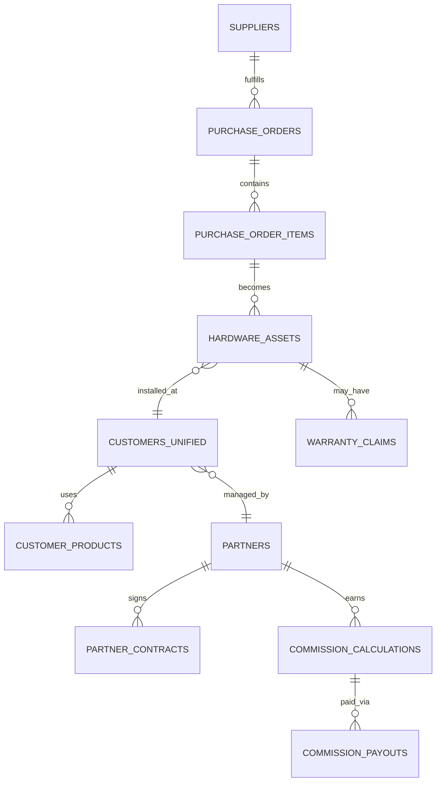

# Data Model — HQ Console

Schema riêng `hq_console`, tách biệt hoàn toàn với schema của `kiosk-management` và `smart-hotel-os`.

## 1. Bảng theo domain

### Tổng hợp sản phẩm (đọc từ API, cache)
```
tenant_summary_cache        -- tổng hợp từ Smart Hotel OS admin API
kiosk_customer_summary_cache -- tổng hợp từ Kiosk admin API
sync_jobs
sync_error_log
```

### Thiết bị phần cứng (sở hữu bởi HQ Console)
```
suppliers
purchase_orders
purchase_order_items
hardware_assets              -- serial number, loại thiết bị, chi phí nhập
hardware_asset_status_history
warranty_claims
warehouse_locations
stock_movements
```

### Đối tác
```
partners
partner_contracts
partner_territories
partner_customer_assignments
```

### Khách hàng 360
```
customers_unified            -- 1 khách sạn, liên kết tới tenant_id (SHO) và/hoặc kiosk_customer_id
customer_products             -- sản phẩm khách hàng đang dùng: KIOSK / SMART_HOTEL_OS / CẢ HAI
customer_support_tickets
customer_billing_status
```

### Hoa hồng
```
commission_rules
commission_calculations
commission_approvals
commission_payouts
```

### Release Console
```
app_release_summary          -- tổng hợp version đang chạy, đọc từ Kiosk + SHO
release_alerts                -- khách hàng chạy bản quá cũ
```

### Nền tảng chung
```
users
roles
permissions
user_roles
audit_logs
api_clients                   -- API key cấp cho đối tác/tích hợp bên ngoài (nếu HQ Console cũng expose API)
```

## 2. Quan hệ chính



## 3. Nguyên tắc

1. `tenant_summary_cache` và `kiosk_customer_summary_cache` là **read cache**, có `last_synced_at`; không phải nguồn sự thật — nếu lệch với sản phẩm gốc, sản phẩm gốc luôn thắng.
2. `hardware_assets.device_id` là khoá liên kết mềm (soft reference) tới `devices.id` bên `kiosk-management`, không phải khoá ngoại cứng xuyên database.
3. Mọi bảng nghiệp vụ có `created_at`, `updated_at`, `created_by`.
4. `commission_calculations` là bảng immutable theo kỳ tính (không sửa sau khi đã duyệt `commission_approvals`) — muốn điều chỉnh phải tạo bản ghi điều chỉnh mới, có tham chiếu ngược, để giữ vết kiểm toán tài chính.
