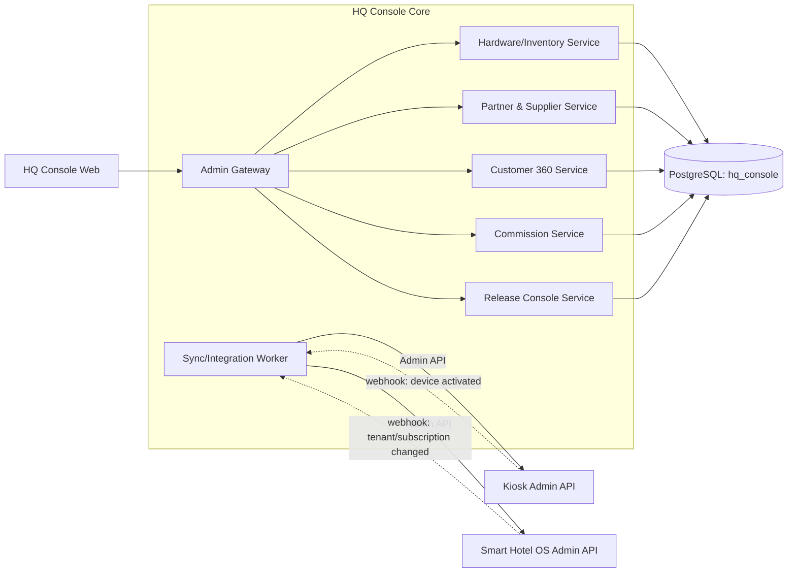

# System Architecture — HQ Console

## 1. Nguyên tắc

1. HQ Console là một **aggregator/orchestrator**, không phải nguồn sự thật (source of truth) cho dữ liệu nghiệp vụ của Kiosk hay Smart Hotel OS.
2. Mọi đọc/ghi tới hai sản phẩm đi qua **Admin API** riêng của từng sản phẩm (đã liệt kê một phần ở `smart-hotel-os/docs/API_SPECIFICATION.md` mục 9, và cần bổ sung tương tự phía `kiosk-management`).
3. Dữ liệu sở hữu riêng bởi HQ Console (không nằm ở hai sản phẩm kia): hồ sơ đối tác/nhà cung cấp, hợp đồng, hoa hồng, tồn kho phần cứng, chi phí mua hàng.
4. Đồng bộ định kỳ (scheduled sync job) + webhook từ hai sản phẩm cho sự kiện quan trọng (tenant mới, subscription đổi gói, thiết bị kích hoạt) thay vì poll liên tục.

## 2. Sơ đồ thành phần



## 3. Đồng bộ với Smart Hotel OS (PMS SaaS)

- `SYNC` worker gọi định kỳ `GET /api/v1/admin/tenants`, `GET /api/v1/admin/tenants/{id}/usage` của Smart Hotel OS.
- Nhận webhook `tenant.created`, `subscription.changed`, `subscription.cancelled` để cập nhật gần real-time thay vì chờ chu kỳ poll.
- Dữ liệu lưu ở HQ Console cho mục đích này chỉ là **bản tổng hợp đọc** (tên tenant, gói, trạng thái, MRR) — không lưu bản sao chi tiết booking/room.

## 4. Đồng bộ với Kiosk Remote Management

- Cần bổ sung Admin API tương đương phía `kiosk-management` (`GET /api/v1/admin/customers`, `GET /api/v1/admin/devices/summary`) — hiện `kiosk.md` đã có endpoint quản trị nhưng chưa định nghĩa riêng nhóm "dành cho HQ Console"; ghi nhận việc cần bổ sung này ở `ASSUMPTIONS.md`.
- Webhook `device.activated`, `device.revoked` để liên kết `device_id` bên Kiosk với hồ sơ tài sản vật lý (`hardware_assets`) bên HQ Console.

## 5. Công nghệ

Đồng bộ stack với hai sản phẩm còn lại để dùng chung nhân sự: Next.js + TypeScript (Web), NestJS + TypeScript (backend), PostgreSQL riêng schema `hq_console` (không chung schema với hai sản phẩm), Redis cho cache tổng hợp/dashboard.

## 6. Cấu trúc thư mục

```text
hq-console/
├── apps/
│   └── hq-web/                 # Web quản trị duy nhất — không có mobile app cho HQ Console ở MVP
├── services/
│   ├── hardware-service/
│   ├── partner-supplier-service/
│   ├── customer-360-service/
│   ├── commission-service/
│   ├── release-console-service/
│   └── sync-worker/
├── packages/
│   ├── shared-types/
│   ├── sdk-kiosk-admin/        # SDK gọi Admin API của kiosk-management
│   └── sdk-sho-admin/          # SDK gọi Admin API của smart-hotel-os
├── docs/
├── infrastructure/
├── README.md
├── ASSUMPTIONS.md
├── DECISIONS.md
└── PROGRESS.md
```

## 7. Bảo mật truy cập nội bộ

HQ Console không public ra Internet mở — chỉ truy cập qua VPN nội bộ hoặc IP whitelist công ty, cộng với MFA bắt buộc cho mọi tài khoản (không có ngoại lệ, kể cả Ban điều hành). Đây là hệ thống nắm nhiều dữ liệu nhạy cảm nhất (tài chính, hợp đồng, dữ liệu khách hàng tổng hợp) nên chuẩn bảo mật phải nghiêm hơn hai sản phẩm bán ra ngoài.
