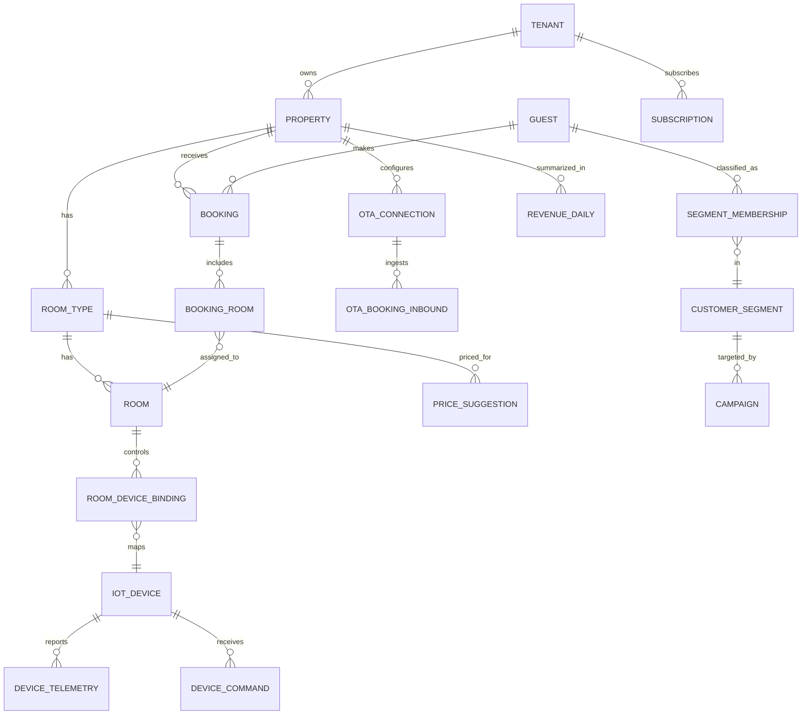

# Data Model — Smart Hotel OS

Mọi bảng nghiệp vụ bắt buộc có `tenant_id` (khách hàng) và, khi áp dụng, `property_id` (cơ sở lưu trú). Không JOIN chéo `tenant_id`.

## 1. Danh sách bảng theo domain

### Identity & Access
```
tenants
users
roles
permissions
user_roles
user_property_access      -- gán user vào property cụ thể (lễ tân chỉ thấy 1 property)
api_clients                -- API key cho bên thứ 3 (kiosk vendor, ERP...)
```

### PMS Core
```
properties
room_types
rooms
room_status_history
rate_plans
seasonal_rates
guests
guest_stay_history
bookings
booking_rooms
booking_status_history
group_bookings
```

### Channel Manager
```
ota_connections            -- credential/kênh kết nối theo property
ota_room_mappings          -- map room_type nội bộ <-> room OTA
inventory_sync_log
rate_sync_log
ota_bookings_inbound
overbooking_incidents
```

### Direct Booking
```
booking_pages              -- website/QR/landing page config theo property
vouchers
voucher_redemptions
upsell_items
payment_transactions
payment_providers
```

### AI Pricing
```
pricing_rules               -- Phase 1 rule-based
pricing_inputs_daily        -- occupancy, sự kiện, giá đối thủ theo ngày
price_suggestions
price_suggestion_overrides   -- khi người dùng chỉnh tay
competitor_prices
```

### IoT Energy
```
iot_devices
iot_device_types
room_device_bindings
device_commands
device_command_results
device_telemetry            -- time-series: điện áp/dòng/công suất
energy_usage_daily
energy_rules                -- checkout->off, pre-activate...
```

### CRM & Marketing
```
customer_segments
segment_membership
campaigns
campaign_triggers           -- checkout, no-return-30d, birthday...
message_templates
message_log
notification_channels
```

### Revenue & Reporting
```
revenue_daily
revenue_by_channel
adr_revpar_daily
loss_prevention_flags       -- booking vs check-in thực tế lệch, sửa giá bất thường
```

### Nền tảng dùng chung
```
audit_logs
business_events              -- event bus outbox
subscriptions                 -- gói Entry/Growth/Pro, feature flags
feature_flags
notification_deliveries
```

## 2. ERD chính (rút gọn)



## 3. Trạng thái quan trọng (state machines)

### Room status
```
VACANT_CLEAN → OCCUPIED → VACANT_DIRTY → CLEANING → VACANT_CLEAN
                        ↘ MAINTENANCE ↗
```

### Booking status
```
PENDING → CONFIRMED → CHECKED_IN → CHECKED_OUT
        ↘ CANCELLED
CONFIRMED ↘ NO_SHOW
```

### Device command status (đồng nhất mô hình với `kiosk.md` mục 7 và mục 10)
```
QUEUED → SENT → ACKNOWLEDGED → APPLYING → SUCCESS
                                        ↘ FAILED → ROLLED_BACK
                             ↘ EXPIRED
```

### Configuration deployment (đồng bộ cấu hình IoT/Room)
```
PENDING → WAITING_DEVICE → DELIVERED → ACKNOWLEDGED → APPLYING → SUCCESS
                                                                ↘ FAILED → ROLLED_BACK
                                                     ↘ EXPIRED
```

## 4. Nguyên tắc thiết kế bắt buộc

1. Mọi thay đổi cấu hình phòng/thiết bị tạo bản ghi version mới (immutable), không update trực tiếp bản ghi đang áp dụng — nhất quán với `kiosk.md` mục 7.
2. `device_telemetry` và `device_command_results` phải có chính sách tổng hợp + xoá dữ liệu cũ (không lưu vô hạn).
3. Dữ liệu nhạy cảm (passport, khuôn mặt nếu tích hợp kiosk trả về) không lưu tại Smart Hotel OS trừ khi có yêu cầu nghiệp vụ rõ ràng và mã hoá tại chỗ.
4. Toàn bộ bảng nghiệp vụ có `created_at`, `updated_at`, `created_by`, `updated_by`.
5. Migration bắt buộc có seed data demo tách biệt hoàn toàn khỏi production (đồng nhất `kiosk.md` mục 21.16).
