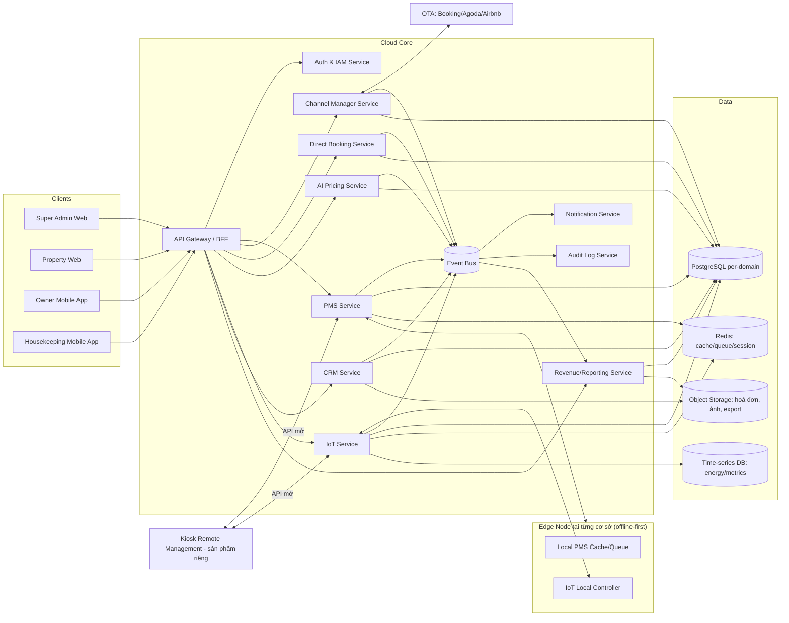

# System Architecture — Smart Hotel OS

## 1. Nguyên tắc kiến trúc

1. Microservice-ready ngay từ đầu, theo module nghiệp vụ (không tách theo tầng kỹ thuật).
2. Offline-first tại cấp cơ sở lưu trú: mỗi property có một "Edge Node" (local service) giữ được nghiệp vụ tối thiểu khi mất Internet.
3. Multi-tenant: cô lập dữ liệu theo `tenant_id` (= customer) và `property_id` ngay ở tầng schema, không dựa vào lọc ở tầng ứng dụng.
4. API-first: mọi service giao tiếp qua API có version; UI chỉ là một client trong nhiều client.
5. Event-driven cho các luồng automation (booking → check-in → IoT → checkout → marketing) để các service không phụ thuộc trực tiếp lẫn nhau.
6. Scale-out theo chiều ngang: service không giữ state trong process; state nằm ở DB/cache/queue.

## 2. Sơ đồ tổng thể



## 3. Danh sách service

| Service | Trách nhiệm | Ghi chú scale |
|---|---|---|
| API Gateway / BFF | Routing, rate limit, aggregation cho từng client (Super Admin/Property/Owner/Housekeeping có BFF riêng) | Stateless, scale ngang sau load balancer |
| Auth & IAM | Đăng nhập, RBAC, MFA, quản lý session, API key cho bên thứ ba | Token JWT ngắn hạn + refresh token xoay vòng |
| PMS Service | Room, booking, check-in/out, walk-in, group booking | Sharding theo `tenant_id` khi vượt ngưỡng |
| Channel Manager Service | Kết nối OTA, đồng bộ tồn phòng/giá, chống overbooking | Cần queue + idempotency vì OTA webhook có thể trùng |
| Direct Booking Service | Website/QR booking, thanh toán, voucher | Tách khỏi PMS để chịu tải traffic công khai (public-facing) |
| AI Pricing Service | Rule-based (Phase 1) → ML (Phase 2) | Batch job tính giá đề xuất hàng đêm + on-demand |
| IoT Service | Nhận trạng thái thiết bị, gửi lệnh điều khiển, luật tiết kiệm điện | Giao tiếp MQTT với Edge Node, publish qua Event Bus |
| CRM Service | Segment khách, campaign, gửi SMS/Zalo/Email | Tích hợp nhà cung cấp gửi tin nhắn ngoài (3rd-party) |
| Revenue/Reporting Service | Tổng hợp doanh thu, ADR, RevPAR, chống thất thoát | Đọc từ read-replica/warehouse, không query trực tiếp OLTP |
| Notification Service | Điều phối kênh gửi (email/SMS/Zalo/push/webhook) | Tách để retry độc lập với nghiệp vụ gốc |
| Audit Log Service | Ghi mọi thao tác quản trị/nghiệp vụ nhạy cảm | Append-only, immutable |

## 4. Offline-first — Edge Node

Mỗi cơ sở lưu trú chạy một Edge Node (dịch vụ local nhẹ, có thể chạy trên máy lễ tân hoặc thiết bị mini-server tại chỗ):

1. Giữ bản sao cục bộ của: booking hôm nay/ngày mai, trạng thái phòng, cấu hình IoT phòng.
2. Cho phép check-in/check-out/walk-in ngay cả khi mất Internet, ghi vào hàng đợi cục bộ (outbox pattern).
3. Khi có mạng trở lại: đồng bộ outbox lên Cloud Core theo thứ tự, giải quyết xung đột theo quy tắc "server-side last-write-wins theo `updated_at` + cảnh báo nếu phát hiện xung đột nghiệp vụ (vd. một phòng bị check-in hai lần)".
4. Không bao giờ khoá nghiệp vụ tại quầy chỉ vì mất kết nối cloud tạm thời — nhất quán với nguyên tắc đã áp dụng cho Kiosk App (`kiosk.md` mục 5.4, mục 21.6).

## 5. Kiến trúc dữ liệu

- PostgreSQL: một database logic theo domain (pms, channel, pricing, iot, crm, revenue), có `tenant_id`/`property_id` bắt buộc trên mọi bảng nghiệp vụ.
- Redis: cache cấu hình, session, hàng đợi lệnh IoT/OTA, rate limiting.
- Time-series DB (vd. TimescaleDB) cho dữ liệu năng lượng/metrics tần suất cao.
- Object storage (S3-compatible): hoá đơn, ảnh, file export báo cáo.
- Event Bus (Kafka hoặc NATS JetStream tuỳ quy mô hạ tầng) cho luồng automation liên service.

Chi tiết bảng dữ liệu: `DATA_MODEL.md`.

## 6. Công nghệ đề xuất

| Lớp | Lựa chọn |
|---|---|
| Frontend Web | Next.js + TypeScript + Tailwind CSS + TanStack Query + React Hook Form + Zod (đồng bộ với stack Kiosk để tái dùng component) |
| Mobile | React Native (dùng chung TypeScript codebase, business logic dùng chung package với web qua `packages/shared-types`) |
| Backend | NestJS + TypeScript (thống nhất một framework, không trộn nhiều backend) |
| Database | PostgreSQL, TimescaleDB extension cho metrics |
| Cache/Queue | Redis |
| Event Bus | NATS JetStream (nhẹ, phù hợp offline-friendly edge) hoặc Kafka nếu quy mô lớn hơn dự kiến — quyết định ghi ở `DECISIONS.md` |
| Realtime (IoT/Edge) | MQTT (đồng nhất với thiết bị IoT) |
| Deployment | Docker, Kubernetes khi vượt quy mô Docker Compose, CI/CD, reverse proxy, HTTPS bắt buộc |

Nếu thay đổi công nghệ so với đề xuất này, phải ghi Architecture Decision Record trong `DECISIONS.md`.

## 7. Repo và cấu trúc thư mục (tách biệt khi build)

```text
smart-hotel-os/
├── apps/
│   ├── super-admin-web/        # Web quản trị tổng thể toàn hệ thống (nhà cung cấp dịch vụ)
│   ├── property-web/           # Web vận hành tại một cơ sở lưu trú (lễ tân/quản lý)
│   ├── property-windows/       # Windows Desktop App — cùng nghiệp vụ với property-web, cho quầy lễ tân không ổn định mạng
│   ├── owner-mobile/           # App mobile cho chủ cơ sở/chuỗi
│   ├── housekeeping-mobile/    # App mobile cho nhân viên dọn phòng/kỹ thuật
│   └── edge-node/              # Dịch vụ offline-first chạy tại cơ sở
├── services/
│   ├── auth-service/
│   ├── pms-service/
│   ├── channel-manager-service/
│   ├── direct-booking-service/
│   ├── ai-pricing-service/
│   ├── iot-service/
│   ├── crm-service/
│   ├── revenue-service/
│   ├── notification-service/
│   └── audit-service/
├── packages/
│   ├── shared-types/
│   ├── validation/
│   ├── api-client/
│   ├── ui-components/
│   └── event-contracts/
├── infrastructure/
│   ├── docker/
│   ├── k8s/
│   ├── nginx/
│   ├── database/
│   └── scripts/
├── docs/
├── tests/
├── .github/workflows/
├── docker-compose.yml
├── README.md
├── ASSUMPTIONS.md
├── DECISIONS.md
└── PROGRESS.md
```

Năm client trong `apps/` (`super-admin-web`, `property-web`, `property-windows`, `owner-mobile`, `housekeeping-mobile`) build và deploy độc lập (pipeline CI/CD riêng, domain riêng, quyền truy cập riêng) — không có ứng dụng nào import trực tiếp code của ứng dụng khác, chỉ dùng chung qua `packages/`. Chi tiết riêng cho `property-windows`: `MODULE_PMS_WINDOWS_CLIENT.md`.

## 8. Khả năng mở rộng tới 500K–1M thiết bị/cơ sở

1. Mọi service stateless, scale ngang bằng cách thêm instance sau load balancer.
2. Sharding PostgreSQL theo `tenant_id` khi một domain vượt ngưỡng (bắt đầu single database, thiết kế schema sẵn sàng shard — không JOIN chéo tenant).
3. IoT/heartbeat dùng MQTT broker cluster (vd. EMQX) chịu tải hàng triệu kết nối persistent, không dùng WebSocket 1-1 tới từng service backend.
4. Tổng hợp dữ liệu heartbeat/metrics theo cửa sổ thời gian, không lưu vô hạn (đồng nhất nguyên tắc với `kiosk.md` mục 8).
5. Read/write tách riêng cho Revenue/Reporting Service (đọc từ replica hoặc warehouse) để không ảnh hưởng OLTP.
6. Feature flag và rate limit theo gói dịch vụ để cô lập tải giữa các tenant.

## 9. Tích hợp với sản phẩm Kiosk (nếu khách hàng dùng cả hai)

Ranh giới rõ: Smart Hotel OS expose các API sau cho Kiosk (hoặc bất kỳ kiosk vendor nào) gọi vào, không chia sẻ database:

- `GET /api/v1/pms/bookings/lookup` — tra cứu booking để check-in tại kiosk.
- `POST /api/v1/pms/checkins` — xác nhận check-in đã hoàn tất tại kiosk.
- `POST /api/v1/pms/checkouts` — xác nhận check-out.
- `POST /api/v1/iot/rooms/{room_id}/activate` — kích hoạt điện/điều hòa phòng sau khi phát thẻ.

Xác thực bằng API key/OAuth2 client credentials cấp cho từng vendor kiosk, không dùng chung cơ chế license của sản phẩm Kiosk.
